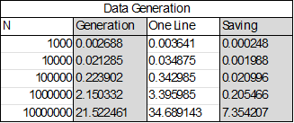
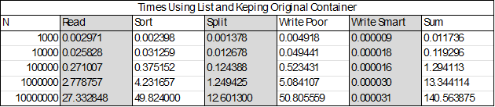
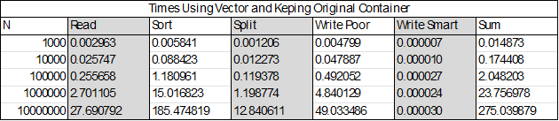
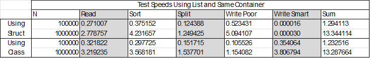
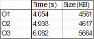

# studijos-objektinis

A program to ease the input of students grades through console or reading from a file.

# Download

1. Download as ZIP and extract.
2. Open console and in the extracted folder (where 'CMakeLists.txt' file exists) run:

    `cmake -G "MinGW Makefile" .`

3. Run these commands:

    ```
    cmake --install .
    cmake --build .
    ```

4. Run `Student_Management_System.exe` and Done!

# Usage

This is a Console Program without UI. 

The messages inside are straightforward.

If you get message `Choice does not exist.` please check for available inputs in the console above.

# V0.1

Created functionality:
* Student data structure to save Student's name, last name, grades and exam grade;
* Input data by hand;
* Calculating final score by Median or Mean;
* Sorting by Students names, last names and final grades;
* Ability to generate random Student grades.

# V0.1.1

Improved:
* Data output to file instead of Console.

# V0.2

Added:
* Data generation to files.

Improved:
* Reworked structure, made use of interfaces.

# V0.3

Improved:
* Cleaned code;
* Did some speed tests.

### Tests:

Test parameters:

- **CPU** - 6C/12T 3.7-4.6GHz
- **RAM** - CL16, 4x8GB, DDR4, 3200 MHz
- **SSD** - SPCC M.2 PCIe SSD

Data Generation times using Vectors:


Data Generation times using Lists:


Data Reading times using Vectors:


Data Reading times using Lists:


# V1.0

Added:
* Ability to chose List or Vector in Console;
* Saving test/generation time data to csv.

Improved:
* Cleaned code.

Fixed:
* Mean or Median not including exam grade.

### Tests:

Test parameters:

- **CPU** - 6C/12T 3.7-4.6GHz
- **RAM** - CL16, 4x8GB, DDR4, 3200 MHz
- **SSD** - SPCC M.2 PCIe SSD

Data Generation times:



Data reading and calculation times using List and keeping original container:



Data reading and calculation times using List and splitting into two containers:


Data reading and calculation times using Vector and keeping original container:


Data reading and calculation times using Vector and splitting into two containers:



# V1.1

Improved:
* Made struct Student into a class;
* Code style.

Fixed:
* Bug with reading too much data;

### Tests:

Speed differences in Inputing Data using struct or class:



Optimization test:



# V1.2

Improved:
* Added rule of three.

# V1.5

Improved:
* Added a virtual Human class;
* Made Student a derived class from Human.

# V2.0

Added:
* Unit tests for data reading from files

