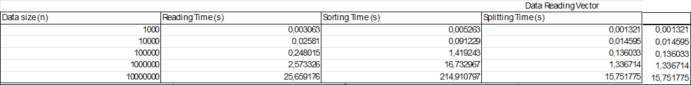
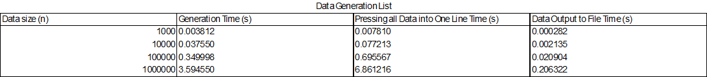
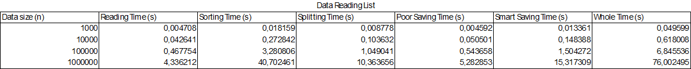

# studijos-objektinis

A program to ease the input of students grades through console or reading from a file.

# V0.3

Test parameters:

**CPU** - 6C/12T 3.7-4.6GHz
**RAM** - CL16, 4x8GB, DDR4, 3200 MHz
**SSD** - SPCC M.2 PCIe SSD

Data Generation times using Vectors:

Data Generation times using Lists:

Data Reading times using Vectors:

Data Reading times using Lists:
